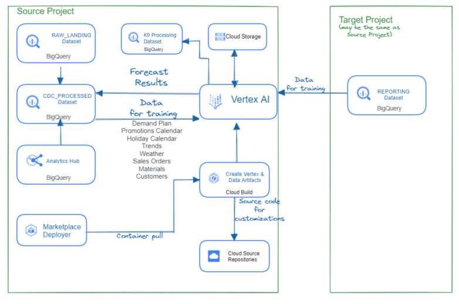
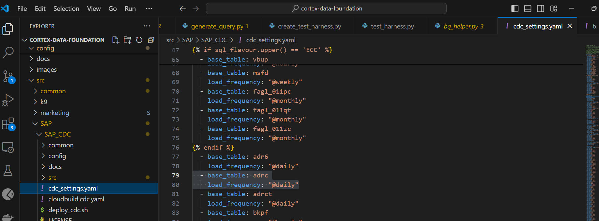

# **Google Cloud Cortex Framework**

## Definition
[Google Cloud Cortex Framework](https://cloud.google.com/solutions/cortex) is a **framework** to **accelerate business insights and outcomes** with **less risk, complexity, and cost** with **reference architectures, packaged solution deployment content, and integration services** by leveraging **data and AI** on the cloud .

### Cortex from Business Perspective

- **Design, build, and deploy data and AI solutions for business**
- **Simplify and accelerate your path to data and AI-powered innovation**
- A faster, smarter way to innovate with groundbreaking AI / data
- Unify enterprise data with groundbreaking AI to unleash transformative insights.
- Mostly for customers dealing with external data sources outside the Google Cloud environment
- Solutions solving for key business focus areas.


#### Key Components of Cortex Framework


##### Leading Connectors


Can be grouped into Google and SAP Managed and Partner Managed. PS will attempt to focus on below: 
1. Google Tooling SLT
2. AecorSoft Data Integrator (Partner Tooling)

###### Google and SAP managed

- SLT - https://www.sap.com/products/technology-platform/landscape-replication-server.html
- Documentation for Connectors - https://cloud.google.com/solutions/sap/docs/sap-data-integration-guides

| GCP Components | SAP requirement |
| --- | --- |
| BigQuery Connector in SLT as add on | **SAP Landscape Transformation Replication Server** |
| BigQuery - requires importing BigQuery tables into SAP Data Services as external metadata | **SAP Data Services** [single enterprise-class solution for data integration, data quality, data profiling, and text data processing] (with SLT [replication])|
| BigQuery - requires ODBC driver | **SAP Datasphere** [data-warehouse-as-a-service] (SLT-based) - need SAP Cloud Connector Configuration to connect to ECC 6.0 |
| BigQuery - requires importing BigQuery tables into SAP Data Services as external metadata | **SAP Data Services**  (without SLT[export/batch job]) |
| Cloud Data Fusion  | Without SLT-based - SAP ODP or SAP BW Open Hub batch source \ With SLT-based - single enterprise-class solution for data integration, data quality, data profiling, and text data processing |
| BigQuery - built-in processor gen-2 or Cloud Storage - replication as files for staging | SAP Data Intelligence (SLT-based)  |

- ~~Google Manufacturing Connect~~
- ~~Datastream~~
- ~~Composer~~

###### Partner managed
| Partner | Tooling | Link |
| --- | --- | --- |
| AecorSoft [Common in SEA] | **AecorSoft Data Integrator - Marketplace (**similar to sap ecc gui**)** | [https://console.cloud.google.com/marketplace/product/calm-cab-386320/aecorsoft-data-integrator](https://console.cloud.google.com/marketplace/product/calm-cab-386320/aecorsoft-data-integrator?project=my-int-cortex-0824) and https://www.aecorsoft.com/en/products/dataintegrator |
| Fivetran [Common in SEA]   | **Fivetran HVR's AppConnect** (similar to sap fiori app gui) | https://www.fivetran.com/blog/simplify-sap-analytics-using-google-cloud-cortex-framework-hvr and https://console.cloud.google.com/marketplace/product/fivetran/fivetran-marketplace?project=my-int-cortex-0824  |
| Informatica | **Intelligent Data Management Cloud** (similar to sap fiori app gui) | https://console.cloud.google.com/marketplace/product/informatica/idmc-prod?project=my-int-cortex-0824 |
| Incorta | **Incorta Open Delivery Platform** (similar to sap fiori app gui) | https://console.cloud.google.com/marketplace/product/incorta/incorta-direct-data-platform?project=my-int-cortex-0824 and  https://www.informatica.com/blogs/sap-data-integration-speed-time-to-value-with-informatica-and-google-cloud-cortex-framework.html and https://www.incorta.com/solutions/google-cloud |
| Qlik [Common in SEA]   | **Qlik Data Integration** (similar to apache nifi gui) | https://www.qlik.com/us/news/company/press-room/press-releases/qlik-expands-strategic-partnership-with-google-cloud and https://console.cloud.google.com/marketplace/product/qlik-marketplace-public/qlik-gcp-marketplace-saas?project=my-int-cortex-0824 |
| Palantir | **Palantir Foundry's HyperAuto** (drag and drop gui) | https://console.cloud.google.com/marketplace/product/palantir-public/palantir-foundry-on-google-cloud?project=my-int-cortex-0824 and https://console.cloud.google.com/marketplace/product/palantir-public/palantir-foundry-usage-based?project=my-int-cortex-0824  |
| SNP [Common in SEA]  | **SNP Glue** | https://datavard.atlassian.net/wiki/spaces/DATAVARD/pages/4640222229/Glue-2405+Google+Cloud+Cortex+Integration and https://console.cloud.google.com/marketplace/product/snp-public/snp-glue?hl=es-419&project=my-int-cortex-0824  |
| Litmus | Need to engage with Litmus to view all available solutions | https://console.cloud.google.com/marketplace/product/litmus-public/intelligent-manufacturing-connect?project=my-int-cortex-0824 |

##### Reference Architectures


##### Deployment Accelerators

- [Application Layer Services](#application-layer-services)
- [Looker Templates](#looker-templates)
- Cortex Data Foundation
- [ML Models](#ml-models)

##### Innovative Solutions

- SAP ML models
- [Application Layer Services](#application-layer-services)


### Cortex from Technical Perspective
- Solution to use services on Google Cloud Platform to ingest data from variety of sources to form a single source of truth in GCP and expose them strategically for business needs


#### Cortex Data Foundation
- **API & Services** to enable usage of services on Google Cloud Platform
- **Identity and Access Management** to configure access for executing user to trigger and execute cloud build
    - [Optional] **Service accounts** impersonation to trigger and execute cloud build
- **Cloud Build** (managed CI/CD) to trigger and execute main build (cortex data foundation) and subsequent build (k9, SAP, Marketing, SFDC and data mesh workloads) to set up the data foundation and generates DAGs for sustaining the data foundation
- **BigQuery** to store Raw, Change Data Capture and Reporting Data
- **Cloud Storage** to store logs of deployment and DAGs (.py and .sql scripts) to be used by Cloud Composer
- [Optional & Dependent] **Dataplex** (Data Fabric) serving as the data mesh (centralized governance, decentralized ownership by considering data product)
- **Cloud Composer** (managed Apache Airflow) to orchestrate and manage workflows to keep the data up to date from external sources
- [Dependent] **Cloud Dataflow** (unified stream and batch data processing at scale) for non-SAP/Marketing workload. From external sources to BigQuery Raw. It is orchestrated with Cloud Composer

#### Application & Integration

Deployed via Marketplace

##### [Application Layer Services](https://console.cloud.google.com/marketplace/details/cortex-public/cloud-cortex-application-layer?project=my-int-cortex-0824)

- facilitate secure integration with external applications to expose and consume results from Cortex Data Foundation.
- Through a microservices-based approach, integration is facilitated through scalable and production ready APIs and Pub/Sub messages.
- goal is to provide solution patterns for interoperability between Cortex Data Foundation and other platforms, as well as to enhance functionality through applications and comprehensive interfaces for low-code solutions.

    
    
- Based on Push Subscription basis
  - Cloud Scheduler is portraying a real system that is meant to consume the service
    
    

##### Demand Sensing
   
   - a cloud based demand sensing solution

#### [Looker Templates](https://github.com/looker-open-source/block-cortex-sap)
 - pre-built Looker blocks targeting operational, marketing and sustainability workloads

#### ML Models
- demand sensing
- SAP ML Models

## About Cortex Data Foundation
**Cortex Data Foundation** is the core architectual component of the Cortex Framework reference architecture and provides packaged analytics artifacts which can be automatically deployed for use with [Google Cloud BigQuery](https://cloud.google.com/bigquery).


# Setting up Cortex Framework Data Foundation
## **Deployment steps**

These are the steps for deployment:

0.  [Prerequisites](#prerequisites)
1.  [Establish project and dataset structure](#establish-project-and-dataset-structure)
2.  [Establish integration mechanism](#establish-integration-mechanism)
3.  [Configure cloud platform components](#configure-google-cloud-platform-components)
4.  [Configure deployment](#configure-deployment)
5.  [Execute deployment](#execute-deployment)
6.  [Test, customize, prepare for upgrade](#test-customize-and-prepare-for-upgrade)
7.  [Next steps for reporting and add-ons](#next-steps)


## Prerequisites

### Understand business requirements and the technical components of the Framework

Before continuing, make sure you are familiar with:
-   Fundamentals of [Change Data Capture and dataset structures](#understanding-change-data-capture)
-   Fundamentals of [Cloud Build](https://cloud.google.com/build/docs/overview)
-   Fundamentals of [BigQuery](https://cloud.google.com/bigquery/docs/introduction)
-   Fundamentals of [Identity and Access Management and Service Account](https://cloud.google.com/iam/docs/)
-   Fundamentals of [Cloud Composer](https://cloud.google.com/composer/docs/concepts/overview) 
-   Fundamentals of [Dataplex](https://cloud.google.com/dataplex)
-   Fundamentals of [Dataflow](https://cloud.google.com/dataflow)

Setup and finalize the [checklist](#checklist-for-production) before proceeding with below steps.


### Understand GitHub Google Cloud Cortex Data Foundation
> **Attention** Please go through this github in the follow manner shown below starting with README.md


### Working with the Data Foundation repository

1. Clone this repository with submodules (`--recurse-submodules`):
   ```bash
   git clone --recurse-submodules https://github.com/GoogleCloudPlatform/cortex-data-foundation
   
   ```

2. Navigate into the previously downloaded folder.
   ```bash
   cd cortex-data-foundation
   ```
   If this is not the first time you have cloned the repository, execute `git pull --recurse-submodules` to pull the latest changes. 


## Establish project and dataset structure
It will require at least one Google Cloud project to host the BigQuery datasets and execute the deployment process.

This is where the deployment process will trigger Cloud Build runs. In the project structure, we refer to this as the [Source Project](#dataset-structure). 

Each workload should have at least one Change Data Capture (CDC) and one Reporting dataset (i.e. one CDC and one Reporting dataset for SAP, one CDC and one Reporting dataset for Salesforce).


> **Note** If you want to have separate sets of projects and datasets for each workload (e.g. one set of source and target projects for SAP and a different set of target and source projects for Salesforce), run separate deployments for each workload.

Below decisions have to be made:
*   **Deploy SAP, Salesforce, etc:** Decide whether you want to deploy models for all workloads or only one set of models.
*   **Source Google Cloud Project:** Project where the source data is located, from which the data models will consume. This project is normally accessed by technical practitioners.
*   **Target Google Cloud Project:** Project where the Data Foundation predefined data models will be deployed and accessed by end-users. This may or may not be different from the source project depending on your needs.
*   **Source BigQuery Dataset (Raw):** BigQuery dataset where the source data is replicated to or where the test data will be created. The recommendation is to have separate datasets, one for each data source (e.g., one raw dataset for SAP and one raw dataset for Google Ads).
*   **CDC BigQuery Dataset:** BigQuery dataset where the CDC processed data lands the latest available records. This may or may not be the same as the source dataset if the tool landing the data performs the CDC merge operation. Some workloads allow for field name mapping here. The recommendation is to have two separate CDC datasets, one for each source (i.e., one cdc dataset for SAP and one CDC dataset for Salesforce).
*   **Target BigQuery reporting dataset:** BigQuery dataset where the Data Foundation predefined data models will be deployed. The recommendation is to have two separate reporting datasets, one for each source (i.e., one reporting dataset for SAP and one reporting dataset for Salesforce). This dataset is automatically created by the deployer if it does not exist.
*   **Target BigQuery machine learning dataset:** BigQuery dataset where the BQML predefined models will be deployed. This dataset is automatically created by the deployer if it does not exist.
*   **Pre-processing K9 dataset:** BigQuery dataset where cross-workload, reusable DAG components, such as time dimensions, can be deployed. The workloads will have a dependency on this dataset unless modified. This dataset is automatically created by the deployer if it does not exist.
*   **Post-processing K9 dataset:** BigQuery dataset where cross-workload reporting (e.g. SAP + Google Ads reporting for [CATGAP](https://github.com/GoogleCloudPlatform/cortex-data-foundation/tree/main/src/k9/src/catgap)) and additional external source DAGs (e.g. Google Trends ingestion) can be deployed. This dataset is automatically created by the deployer if it does not exist.


**Alternatively**, if you do not have a replication tool set up or do not wish to use the replicated data, the deployment process can generate test tables and fake data for you. You will still need to [create](https://cloud.google.com/bigquery/docs/datasets) and identify the CDC and Raw datasets ahead of time.

These parameters will be different for each workload depending on the integration mechanism.

## Establish integration mechanism

Each workload has different ways to integrate with BigQuery. This section explains the options for each source.

> **Note**: **Using test data?** You can skip this section.


* [Integration options for SAP ECC or SAP S/4HANA](./README_SAP.md)
* [Integration options for Salesforce Sales Cloud](./README_SFDC.md)
* [Integration options for Marketing data sources](./README_Marketing.md)
* [Integration options for Sustainability data sources](./README_Sustainability.md)


## Configure Google Cloud Platform components

### Setting the Right Project 
Provide project id for source project 
```
gcloud config set project <<SOURCE_PROJECT>>
```

### Enable API Access for Project

The following Google Cloud components are required:

*   BigQuery instance and datasets (compulsory)
*   Service Account with Impersonation rights (compulsory)
*   Cloud Storage Buckets (compulsory)
*   Cloud Build API (compulsory)
*   Cloud Resource Manager API (compulsory)
*   Optional components:
    *   [Cloud Composer](https://console.cloud.google.com/marketplace/product/google/composer.googleapis.com) for change data capture (CDC) processing, hierarchy flattening (SAP only), and data replication (Non-SAP only) through Directed Acyclic Graphs ([DAGs](https://airflow.apache.org/docs/apache-airflow/stable/concepts/dags.html)). Compulsory for setting up DAGs scripts.
    *   [Dataplex](https://cloud.google.com/dataplex): Used for building a Data Mesh, view [documentation](https://github.com/GoogleCloudPlatform/cortex-data-foundation/tree/main/docs/data_mesh/README.md). This is provided by the datacatalog api
    *   [Dataflow](https://console.cloud.google.com/dataflow): Integration tool for many of the Marketing data sets like Google Ads.
    * dataflow (), datacatalog (for mesh) are dependent on the workload
    *   Looker **(optional)** connects to reporting templates. Requires manual setup
    *   [Analytics Hub](https://cloud.google.com/analytics-hub) linked datasets **(optional)** are currently used for some external sources, such as the Weather DAG. You may choose to fill this structure with any other available source of your choice for advanced scenarios.


```bash

gcloud services enable bigquery.googleapis.com \
                       cloudbuild.googleapis.com \
                       composer.googleapis.com \
                       storage-component.googleapis.com \
                       cloudresourcemanager.googleapis.com \
                       datacatalog.googleapis.com \
                       dataflow.googleapis.com
```

### Configure the Cloud Build service account for deployment with impersonation

You need to create and grant a Cloud Build service account permissions to execute builds on executing user's behalf and deploy Cortex.

The deployment can run through a service account with impersonation rights, by adding the flag [\--impersonate-service-account](https://cloud.google.com/sdk/gcloud/reference/builds/submit). This service account will trigger a Cloud Build job that will in turn run specific steps through the Cloud Build service account. This allows a user to trigger a deployment process without direct access to the resources.

The impersonation rights to the new, triggering service account need to be granted to the person running the command.

1. Find the default Cloud Build service account with below command and disable the service account with IAM console
    ```bash
    gcloud builds get-default-service-account --project <execution project id>
    ```
    `<project number>-compute@developer.gserviceaccount.com` or `<project number>@cloudbuild.gserviceaccount.com`, This is your default Cloud Build service account.

2. Create service account to impersonate during deployment


3. Grant the following permissions to the Cloud Build service account in the source project (and the target project if deploying to a separate target):


<details>
    <summary> [Optional] Configure Access for Data Mesh Additional Workload </summary>

If changing the default values for Data Mesh in `config/config.json` to implement features beyond descriptions, the executing account (Cloud Build service account) will need to have the following additional permissions:

    - Policy Tag Admin
    - Data Catalog TagTemplate Owner
    - Dataplex Editor
    - BigQuery Data Owner


</details>

### Grant permissions to Executing User

For user executing deployment, they will need, at minimum, the following permissions in the project where Cloud Build will be triggered:

- [x]  `Service Usage Consumer`
- [x]  `Storage Object Viewer` for the Cloud Build default bucket or bucket for logs
- [x]  `Cloud Build Editor`
    - [x]  Object Writer to the output buckets - inherited
- [x]  `Service Account Token Creator`
    - [x]  Granted to user to be able to impersonate service account and run the cloud build without the default service account
- [x]  `Service Account User`
    - [x]  Granted to both executing user (to use the service account) and to service account (to use itself during impersonation) to run the cloud build without the default service account

> To assume the identity of a service account and perform actions as that service account you use the Token Creator role. 
To use a service account, you need the User role. 


### End Result in IAM


- service account to run cloud composer 
- service account to execute cloud build 
- user to impersonate service account to execute cloud build

### Create a Storage bucket for storing DAG related files

A storage bucket will be required to store processing DAG scripts and other temporary files generated during deployment. These scripts will have to be manually moved into a Cloud Composer instance after deployment.

Create a Google Cloud Storage bucket **in the same region** as your BigQuery datasets.

```bash
gsutil mb -l <REGION/MULTI-REGION> gs://<BUCKET NAME>
```
Grant `Storage Object Creator` to the user executing the Build command or to the Service account you created for impersonation

### Create a Storage bucket for logs

Create a specific bucket for the Cloud Build process to store the logs. Create a [GCS bucket](https://console.cloud.google.com/storage) with uniform access control, in the same region where the deployment will run.

```bash
gsutil mb -l <REGION/MULTI-REGION> gs://<BUCKET NAME>
```

Grant `Storage Object Admin` permissions to the Cloud Build service account.

## Configure deployment

The behavior of the deployment is controlled by the configuration file [config.json](https://github.com/https-github-com-PointStarCloud/cortex-data-foundation/blob/pointstar-main/config/config.json).

The file contains global configuration, configuration specific to each workload and optional Credly badger service.


### Global Deployment configuration

Consider your target deployment:


| Parameter                 | Meaning                 | Default Value      | Description                                                                      |
| ------------------------- | ----------------------- | -------------------| ------------------------------------------------------------------------         |
| `testData`                | Deploy Test Data        | `true`             | Determines whether the raw landing dataset should be populated with test data. Only available for ecc for now.                      |
| `deploySAP`               | Deploy SAP              | `true`             | Determines if SAP (ECC or S/4HANA) workload should be deployed.                        |
| `deploySFDC`              | Deploy Salesforce       | `true`             | Determines if Salesforce(SFDC) workload should be deployed.                                  |
| `deployMarketing`         | Deploy Marketing        | `true`             | Determines if Marketing (Google Ads, CM360 and/or TikTok) workload should be deployed. |
| `deployDataMesh`          | Deploy Data Mesh        | `true`             | Determines if datamesh workload should be deployed. It will be using dataplex, see the Data Mesh [README](https://github.com/GoogleCloudPlatform/cortex-data-foundation/tree/main/docs/data_mesh/README.md) for more info. |
| `turboMode`               | Deploy in Turbo mode    | `true`             | Execute all views builds as a step in the same Cloud Build process, in parallel for a faster deployment. If set to `false`, each reporting view is generated in its own sequential build step. We recommend only setting it to `true` when using test data or after any mismatch between reporting columns and the source data have been resolved. |
| `projectIdSource`         | Source Project ID       | -                  | Project where the source dataset is and the build will run/ project hosting the raw and cdc.                      |
| `projectIdTarget`         | Target Project ID       | -                  | Target project for user-facing datasets (reporting and ML datasets)/ project hosting the reporting and ML dataset.             |
| `targetBucket`            | Target Bucket to storage generated DAG (.py and sql) scripts | - | Bucket [created previously](#create-a-storage-bucket-for-storing-dag-related-files) where DAGs (and Dataflow temp files) will be generated. Avoid using the actual Airflow bucket. |
| `location`                | Location or Region      | `"US"`             | Same location where the BigQuery dataset and GCS buckets are. <br><br> > **Note**: See restrictions listed under [BigQuery dataset locations](https://cloud.google.com/bigquery/docs/locations). |
| `languages`               | Filtering languages     | `[ "E", "S" ]`     | If not using test data, enter a single language (e.g., `[ "E" ]`) or multiple languages (e.g., `[ "E", "S" ]`) as relevant to your business. These values are used to replace placeholders in SQL in analytics models where available (SAP only for now - see the ERD). |
| `currencies`              | Filtering currencies    | `[ "USD" ]`        | If not using test data, enter a single currency (e.g., `[ "USD" ]`) or multiple currencies (e.g., `[ "USD", "CAD" ]`) as relevant to your business. These values are used to replace placeholders in SQL in analytics models where available (SAP only for now - see the ERD). |
| `testDataProject`         | Source for test harness | `kittycorn-public` | Source of the test data for demo deployments. Applies when `testData` is `true`. <br><br> > **Note**: Unless you have your own test harness, do not change this value. |
| `k9.datasets.processing`  | K9 datasets - Processing| `"K9_PROCESSING"`  | Execute cross-workload templates (e.g., date dimension) as defined in the [K9 configuration file](https://github.com/GoogleCloudPlatform/cortex-data-foundation/tree/main/src/k9/config/k9_settings.yaml). These templates are normally required by the downstream workloads. |
| `k9.datasets.reporting`   | K9 datasets - Reporting | `"K9_REPORTING"`   | Execute cross-workload templates and external data sources (e.g., Weather) as defined in the [K9 configuration file](https://github.com/GoogleCloudPlatform/cortex-data-foundation/tree/main/src/k9/config/k9_settings.yaml). Commented out by default. |
| `DataMesh.deployDescriptions` | Data Mesh - Asset descriptions | `true`  | Deploy BigQuery asset schema descriptions. |
| `DataMesh.deployLakes`    | Data Mesh - Lakes & Zones | `false`          | Deploy Dataplex Lakes & Zones that organize tables by processing layer, requires configuration before enabling. |
| `DataMesh.deployCatalog`  | Data Mesh - Catalog Tags & Templates | `false` | Deploy Data Catalog Tags that allow custom metadata on BigQuery assets or fields, requires configuration before enabling. |
| `DataMesh.deployACLs`     | Data Mesh - Access Control | `false`         | Deploy asset, row, or column level access control on BigQuery assets, requires configuration before enabling. |

> For your own customizations and a faster deployment in your own development pipelines, you can use the `turboMode` variable in `config/config.json`. When set to true, the deployment process will dynamically generate a `cloudbuild.views.yaml` file with each view in the right dependencies file (e.g., dependencies_ecc.txt or dependencies_s4.txt) as a single step of the build. This allows for a 10x faster deployment. The limitation is that if an error occurs when deploying a view, the build process will stop, and this is a slow way to find out all possible mismatches between the Cortex views and your datasource when compared to the turboMode=false option. If you are still fixing potential structure mismatches between the SELECT clauses in the views and the fields available in your replicated tables, `TURBO=false` will take longer but will attempt to generate all views even if one fails. This will help identify and fix more errors in a single run.

### Workload-specific configuration

The following sections are specific to each workload. You do not need to configure them if the deployment parameter (e.g., `deploySAP` or `deployMarketing`) for the workload is set to `False`.
These can all be configured in the `config/config.json`
> kittycorn-public is a docker image of GNU/LINUX 12 bookworm
* [SAP](./README_SAP.md#deployment-configuration-for-sap)
  - configure load_frequency: "RUNTIME" if there is a need for immediate data in CDC dataset tables 
  
  
  - deployCDC will copy the target dataset and tables to CDC dataset and tables
  - prepopulate the dataset name for cdc, raw, ml and reporting
  - mandt is dependent on the client’s source system 

* [Salesforce Sales Cloud](./README_SFDC.md#deployment-configuration-for-salesforce)

* [Marketing](./README_Marketing.md#deployment-configuration-for-marketing)

#### **Performance Optimization for Reporting Views/Tables**


Reporting artifacts can be created as views or as tables refreshed regularly through DAGs. On the one hand, views will compute the data on each execution of a query, which will keep the results always fresh. On the other hand, the table will run the computations once, and the results can be queried multiple times without incurring higher computing costs and achieving faster runtime. This balance is very specific to each customer, so we encourage each customer to create their own configuration to serve their needs.

Materialized results are updated into a table. These tables can be further fine-tuned by adding Partitioning and Clustering properties to these tables.


#####  Customizing `reporting_settings` file configuration

This settings file drives how the BQ objects (tables or views) for Reporting datasets are created.

There are two sections:

 1. `bq_independent_objects`:
    All BigQuery objects that can be created independently, without any other dependencies.
    > **Note**: When Turbo mode is enabled, these BQ objects are created in parallel during the deployment time, speeding up the deployment process.

 2. `bq_dependent_objects`:
     All BigQuery objects that need to be created in a specific order due to dependencies on other BQ objects.
     > **Note**: Turbo mode does not apply to this section - i.e., each object will be created one after another.

The deployer will first create all the BQ Objects listed in `bq_independent_objects` first, and then all the objects
listed in `bq_dependent_objects`.

Following properties need to be defined for each object:
1. `sql_file`:  Name of the sql file that will create a given object.

2. `type`: Type of BQ Object.
    Possible values:
    * `view` : If we want the object to be a BQ view.
    * `table`: If we want the object to be a BQ table.
    * `script`: This is to create other types of objects (BQ Functions, Stored Procs etc)

3. If `type` is `'table'`, then following optional properties can be defined:
     * `load_frequency`: Frequency at which a Composer DAG will be executed to refresh this table. Mandatory. See [Airflow documentation](https://airflow.apache.org/docs/apache-airflow/1.10.1/scheduler.html#dag-runs) for details on possible values.
     * `partition_details`: How the table should be partitioned. **Optional.** See below section [Table Partition and Cluster Settings](#table-partition-and-cluster-settings) for details on how to configure this.
     * `cluster_details`: How the table should be clustered. **Optional.** See Appendix section [Table Partition and Cluster Settings](#table-partition-and-cluster-settings) for details on how to configure this.

Sample
- Change load frequency
    
    
    
    
- Convert table to view
    

##### Table Partition and Cluster Settings
For certain settings files (e.g. SAP CDC settings file `cdc_settings.yaml` or all Reporting settings yaml file `reporting_settings.yaml`) provide a way to create materialized tables with clusters or partitions of your choice. This is controlled by the following properties in the settings file:

###### Table Partitioning
Partition can be enabled by specifying `partition_details`:

Example:
```yaml
   - base_table: vbap
     load_frequency: "@daily"
     partition_details: {
       column: "erdat", partition_type: "time", time_grain: "day"
     }
```
Use following parameters to control partitioning details for a given table:

| Property               | Description                                                            | Value           |
| ---------------------  | ---------------------------------------------------------------------- | --------------- |
| `column`               | Column by which the CDC table will be partitioned                      | Column name     |
| `partition_type`       | Type of Partition                                                      | `"time"` for time based partition ([More details](https://cloud.google.com/bigquery/docs/partitioned-tables#date_timestamp_partitioned_tables))<br>`"integer_range"` for integer based partition ([More details](https://cloud.google.com/bigquery/docs/partitioned-tables#integer_range)) |
| `time_grain`           | Time part to partition with <br>Required when `partition_type = "time"`| `"hour"`, `"day"`, `"month"` OR `"year"` |
| `integer_range_bucket` | Bucket range <br>Required when `partition_type = "integer_range"`      | `"start"` = Start value<br> `"end"` = End value<br>`"interval`" = Interval of range |

> **NOTE** See BigQuery Table Partition [documentation](https://cloud.google.com/bigquery/docs/partitioned-tables) details to understand these options and related limitations.

###### Table Clustering
Similarly, clustering can be by specifying `cluster_details`:

Example:
```yaml
   - base_table: vbak
     load_frequency: "@daily"
     cluster_details: {columns: ["vkorg"]}
```
| Property               | Description                                | Value                                             |
| ---------------------  | -------------------------------------------| ------------------------------------------------- |
| `columns`              | Columns by which a table will be clustered | List of column names<br>e.g. `["mjahr", "matnr"]` |

> **NOTE**: See BigQuery Table Cluster [documentation](https://cloud.google.com/bigquery/docs/clustered-tables) details to understand these options and related limitations.

Sample
- Convert view to table and add partitioning and clustering with time and integer based
    
    
    

### Configure K9 deployments

The K9 deployer is responsible for ingestion, processing and modeling of components that are reusable across different data sources. For example, the time dimension is reusable across all data sources where tables may need to slice and dice analytical results based on a Gregorian calendar.

External data sources that can be combined across different workloads to gain enriched insights and are also reusable are part of the K9 deployer. For example, Weather data or Google Trends ingestion and processing can be combined across SAP, Salesforce and Marketing data sources. [CATGAP](https://github.com/GoogleCloudPlatform/cortex-data-foundation/tree/main/src/k9/src/catgap) is an example which combines Google Ads and SAP.


The pre-processing K9 step executes before all workloads start their deployment, so the reusable models are available during their deployment. Conversely, the post-processing K9 executes after all modules have deployed their reporting models so the cross-workload reporting or augmenting models find their dependencies within each reporting dataset.


The DAGs and models to be generated can be configured in [K9 configuration file](https://github.com/GoogleCloudPlatform/cortex-data-foundation/tree/main/src/k9/config/k9_settings.yaml).

- with and without test data, default settings will return these 6 tables.
- without test data, only calendar_date_dim will be pre-populated
- the default date_dimension, holiday_calendar and sustainability can be commented out if any of the workloads are not required


1. **Date_Dimension:**
- [ ]  add admin > connection ‘sap_cdc_bq’ in airflow web BQ connection and uncheck legacy sql

2. **Holiday_Calendar**:
- This DAG retrieves the holiday calendars from  [PyPi Holidays](https://pypi.org/project/holidays/). Leave the defaults if using test data.
- [ ]  can adjust country and years from src/k9/src/holiday_calendar/holiday_calendar.ini
- [ ]  when deployed without test data, k9processing bigquery table will be blank. However, the DAG will populate the BQ table with the right parameter
- [ ]  add below pypi in composer env before running the DAGs script
    `holidays`

3. **Sustainability & ESG insights**:
- Cortex Data Framework combines SAP supplier performance data with advanced ESG insights to compare delivery performance, sustainability & risks more holistically across global operations. For more details, see guide [here](README_Sustainability.md).
- [ ]  must first acquire **Dun & Bradstreet data -**  loaded as `dun_bradstreet_esg` table in `K9 Processing` dataset
- [ ]  reporting can be configure here src/k9/src/sustainability/reporting/sustainability_reporting.yaml
- [ ]  add admin > connection ‘k9_reporting_bq’ in airflow web BQ connection and uncheck legacy sql

#### [Optional] Configure external datasets for K9

Some advanced use cases may require external datasets to complement an enterprise system of record such as SAP. In addition to external exchanges consumed from [Analytics hub](https://cloud.google.com/analytics-hub), some datasets may need custom or tailored methods to ingest data and join them with the reporting models.

**Note:** You will need to configure the DAGs as follows:


1. **Trends**: 
- This DAG retrieves Interest Over Time for a specific set of terms from [Google Search trends](https://trends.google.com/trends/). 
- Requires customer insights to configure **Product Hierarchy Texts**
    - src/SAP/SAP_REPORTING/local_k9/prod_hierarchy_texts/prod_hierarchy_texts.sql
    - levels of the hierarchy, language and matching “left” algorithm
    - 1. **Product Hierarchy Texts**: This DAG flattens materials and their product hierarchies. The resulting table can be used to feed the `Trends` list of terms to retrieve Interest Over Time. You can adjust the parameters of the DAG from the file `prod_hierarchy_texts.py`. Leave the defaults if using test data. You will need to adjust the levels of the hierarchy and the language under the markers for `## CORTEX-CUSTOMER:`. If your product hierarchy contains more levels, you may need to add an additional SELECT statement similar to the CTE `h1_h2_h3`.

- The terms can be configured in `trends.ini`. 
- need to adjust the time frame to `'now 7-d'` in `trends.py` after an initial run.
- Reporting can be configure here src/k9/src/trends/reporting/trends_reporting.yaml
- Add below pypi in composer env
    `pytrends~=4.9.2`
- Recommended getting familiarized with the results coming from the different terms to tune parameters
- Recommended partitioning large lists to multiple copies of this DAG running at different times
- So far only interest over time works. top and rising features are broken
- For more information about the underlying library being used, see [Pytrends](https://pypi.org/project/pytrends/).

2. **Weather**: 
- uses the publicly available test dataset [**bigquery-public-data.geo_openstreetmap.planet_layers**](https://console.cloud.google.com/bigquery/analytics-hub/exchanges(analyticshub:search)?queryText=open%20street%20map) and NOAA dataset only available through Analytics Hub, [**noaa_global_forecast_system**](https://console.cloud.google.com/bigquery/analytics-hub/exchanges(analyticshub:search)?queryText=noaa%20global%20forecast). 
- **`This dataset needs to be created in the same region as the other datasets prior to executing deployment`**. 
- [ ]  requires importing public dataset from US to respective region shown below
    - [ ]  SELECT  creation_time,geography,geography_polygon, forecast
    FROM `bigquery-public-data.noaa_global_forecast_system.NOAA_GFS0P25` ,
    UNNEST(forecast) as forecast
    - [ ]  SELECT *
    FROM `bigquery-public-data.geo_openstreetmap.planet_layers`
    - [ ]  requires scheduled query and transfer service
        If you are targeting a location different from the one available for the required dataset, we recommend creating a [scheduled query](https://cloud.google.com/bigquery/docs/scheduling-queries) to copy the new records from the Analytics hub linked dataset followed by a [transfer service](https://cloud.google.com/bigquery-transfer/docs/introduction) to copy those new records into a dataset located in the same location or region as the rest of your deployment. You will then need to adjust the SQL files .

3. **CATGAP**

4. **Local K9**:
- These are similar to pre and post processing K9 but are positioned at local level. So the sharing of the datasets here are only limited to the workload. Essentially, these DAGs should also be used by cloud composer for sustaining the BQ workloads after first deployment

### Configure Data Mesh
The default configuration in `config/config.json` for Data Mesh will add the descriptions for all assets, but will not create any other structures or policies.

> DeployDescriptions requires no additional config. It will create description for all columns and tables in all the workloads for BigQuery columns depending on the config files shown below for each workload


Enabling any other options (deployLakes, deployCatalog, deployACLs) requires the configuration of permissions for the Cloud Build service account and the necessary configuration of the yaml files.

Here is a high-level diagram of the available options:


You will find detailed instructions and examples to configure Data Mesh in the [documentation](https://github.com/GoogleCloudPlatform/cortex-data-foundation/tree/main/docs/data_mesh/README.md).

> to overwrite existing data mesh action:  include the flag “—overwrite” when deploying python src/common/data_mesh/deploy_data_mesh.py

#### SAP Data Mesh
- Below are the Configuration File


##### Lakes, Zones and Assets
- Lakes, zones and assets configure from the “lakes” directory


- enables perform of Data Catalog search which Google Cloud assets and metadata created in Data Catalog

##### Catalog Tag Template

- define the types and field names which can be used to annotate the assets later.


- annotation is used in yaml definition file
- search can then be performed for discovery in dataplex


- deployCatalog and deployACLsshould be considered to be deployed together to provide asset, row and column access control level

##### Policy Tag Taxonomies
- policy tag has to be setup in policy_taxonomy yaml file


- policy are then assigned in annotation yaml file


- with this there are column masking in bigquery table

##### Annotation
- Provide discovery via table and column description coming from “description”


- asset, row (row access are granted on sets of rows based on certain column value filters) and column level accesses are also granted here for the bq


- asset level access only works for those that are non-owner role. For those with existing / inherited owner role, it does not create any effect


- this is from granting row level access. user would only be able to access those filtered rows

#### Marketing Data Mesh

#### SalesForce Data Mesh


### Check for `CORTEX_CUSTOMER` tags for customization
Many SAP and Salesforce customers will have specific customizations of their systems, such as additional documents in a flow or specific types of a record. These are specific to each customer and configured by functional analysts as the business needs arise. The spots on the SQL code where these specific enhancements could be done are marked with a comment starting with `## CORTEX-CUSTOMER`. You can check for these comments after cloning the repository with a command like:

```bash
grep -R CORTEX-CUSTOMER
```

> **Note**: There may be additional customizations depending on the source systems. We recommend getting the business users or analysts involved early in the process to help spot these.

## Execute deployment

This step requires `config.json` to be configured as described in the section [Configure Deployment](#configure-deployment).

Run the Build command with the target log bucket.

```bash
gcloud builds submit --impersonate-service-account=<ServiceAccount> --project <execution project, likely the source> --substitutions=_GCS_BUCKET=<Bucket for logs - Cloud Build Service Account needs access to write here>
```

If you have enough permissions, you can see the progress from [Cloud Build](https://console.cloud.google.com/cloud-build/).


Each build step will trigger child build steps. These can be tracked from the Cloud Build console:


Or finding the logs for the child build within the log from a step:


And identify any issues with individual builds:


We recommend pasting the generated SQL into BigQuery to identify and correct the errors more easily. Most errors will be related to fields that are selected but not present in the replicated source. The BigQuery UI will help identify and comment those out.

### Possible Error during Deployment

- no comments allowed in json: remove all comments from config.json
    
    
    
- target bucket does not required “gs” prefix: remove all prefix gs from config.json
    
    

- raw and cdc dataset are required in config if no test data are used : create dataset manually before running deployment
    
    
    
- permission error for pre k9: executing user should have Service Account Token Creator role to impersonate the impersonated SA. Then, configure impersonated Service Account with Service Account user role to execute cloud build Service Account (it could be to itself or another service account). All cloudbuild*.yaml should be configured with “service account: cloud build SA”
    
    
    
    

### Possible Scenario during Deployment

### Run only with testdata=false and deploysap=true
- [x]  requires raw Dataset, CDC dataset and tables in raw Dataset to be present in advanced

**Output Steps:**
- [x]  init_deploy_config
- [x]  k9-pre - without test data, only calendar_date_dim will be prepopulated
- [x]  sap-test-harness - skipped as no test data is required
- [x]  sfdc-test-harness - skipped as no test data is required
- [x]  sap-cdc - only tables are created
- [x]  sap-reporting - only tables are created
- [x]  sap-ml-models -skipped based on initial config
- [x]  sfdc-deploy -skipped based on global configuration
- [x]  marketing-test-harness - skipped as no test data is required
- [x]  marketing-deploy -skipped based on global configuration
- [x]  k9-post - only tables are created
- [x]  credly-badge - optional: to provide credly badge
- [x]  raw dataset - have to be created manually before running the deployment
- [x]  raw table - have to be created manually before running the deployment
- [x]  cdc dataset - have to be created manually before running the deployment
- [x]  cdc table - will create all the tables based on the tables existing in the raw dataset
- [x]  To replicate data from raw to CDC for first time, cloud composer can handle them with the DAGs scripts

### Run with testdata=true and deploysap=true
- this should not be used for production 
- [x]  raw dataset and CDC dataset are required to be created but no tables need to be prepopulated

**Output Steps:**
- [x]  init_deploy_config
- [x]  k9-pre - will be prepopulated
- [x]  sap-test-harness -  ran as test data is required
- [x]  sfdc-test-harness - skipped as no test data is required
- [x]  sap-cdc - tables and test data are created
- [x]  sap-reporting - only tables are created
- [x]  sap-ml-models -skipped based on initial config
- [x]  sfdc-deploy -skipped based on global configuration
- [x]  marketing-test-harness - skipped as no test data is required
- [x]  marketing-deploy -skipped based on global configuration
- [x]  k9-post - tables and test data  are created
- [x]  credly-badge - optional: to provide credly badge
- [x]  raw dataset - have to be created manually before running the deployment
- [x]  raw table - will create all the tables based on existing test data from Cortex Framework
- [x]  raw data - will be generated with test data from kittycorn-public. If raw table is already created, it will skipped the test data from kitty corn and no test data will be populated. Additionally, the reporting and cdc tables will be populated with the existing data in the raw tables and not with those from kittycorn-public
    
    
    
- [x]  cdc dataset - have to be created manually before running the deployment
- [x]  cdc table - will create all the tables based on the tables existing in the raw dataset
- [x]  cdc data - generated with test data

### [TBC] Run with testdata true and full deploy SAP, SDFC, Marketing
- this should not be used for production 
- [x]  raw dataset and CDC dataset are required to be created but no tables need to be prepopulated

**Output Steps:**
- [x]  init_deploy_config
- [x]  k9-pre - will be prepopulated
- [x]  sap-test-harness -  ran as test data is required
- [x]  sfdc-test-harness - ran as test data is required
- [x]  sap-cdc - tables and test data are created
- [x]  sap-reporting - only tables are created
- [x]  sap-ml-models - skipped based on initial config
- [x]  sfdc-deploy - cdc tables and test data are created
- [x]  marketing-test-harness - ran as test data is required
- [x]  marketing-deploy - cdc tables and test data are created
- [x]  k9-post -  cdc tables and test data  are created
- [x]  credly-badge - optional: to provide credly badge
- [x]  generates 25 tables for all workload
- [x]  raws, cdc and reporting have test data and scripts are generated in the DAGs bucket

### Marketing

- [ ]  

### SFDC

- [ ]  

### Tables / Columns Adjustment

- [x]  Excluding tables for SAP:
    - remove base_table and load_frequency entry from cdc_settings.yaml.
    - only works if we exclude all impacted reporting from reporting_settings_ecc.yaml
    
    
    
    
    
    
    
    - Might be able to bypass the *validate_sql* but risk having issue when using the existing reports. So this is not recommended. Rather, we should assess the impact and remove the relevant reports
    
- [x]  Including tables for SAP:
    - ensure dd03l table in raw dataset is populated with the tables to be included
    - the raw dataset must also have the table
    - add base_table and load_frequency entry into cdc_settings.yaml
    - deploy with workload without test data
- [x]  Add columns
    - Only works during first deployment. Moving forward, it should be manually altered via BQ while assessing impact to all DAGs and reporting dataset
    - Add columns to Raw table. CDC dataset tables would automatically get the new columns provided that the table in CDC is not created
- [x]  Remove columns
    - Only works during first deployment. Moving forward, it should be manually alter via BQ while assessing impact to all DAGs and reporting dataset
    - Remove columns from Raw table. CDC dataset tables would not retrieved the outdated columns provided that the table in CDC is not created

### Deploying Data Mesh Alone

- need to store a copy of the service account key before running docker IT
- docker run -it --mount type=bind,src=/home/fangwei_lim/cortex-data-foundation,dst=/usr/src/app/cortex-data-foundation [gcr.io/kittycorn-public/deploy-kittyc](http://gcr.io/kittycorn-public/deploy-kittyc)orn:v2.0
    - cd cortex-data-foundation
    - export GOOGLE_APPLICATION_CREDENTIALS="credentials.json"
    - python src/common/data_mesh/deploy_data_mesh.py \
    --config-file config/config.json \
    --lake-directories \
    src/SAP/SAP_REPORTING/config/ecc/lakes \
    --tag-template-directories \
    src/SAP/SAP_REPORTING/config/ecc/tag_templates \
    --policy-directories \
    src/SAP/SAP_REPORTING/config/ecc/policy_taxonomies \
    --annotation-directories \
    src/SAP/SAP_REPORTING/config/ecc/annotations \
    --overwrite
- delete the image and credentials key and delete that key from SA

### SAP ML Models

- current configuration in cortex-data-foundation are only samples
- To use, setup sql script for BigML and update dependencies. There’s a chance public dataset has to be replicated if not available in the region and BQ slots might need to be reserved for training
- This step should be used in production only if the same deployment and result has been validated in production. Otherwise, this should be ran separately once the cortex-data-foundation is setup


## Post-Deployment
### Configure Cloud Composer 
- This is to enable the data in either CDC or reporting to be updated

#### Verify Output Cloud Storage
`gsutil -m cp -r "gs://cortex-data-foundation-dag/dags" "gs://cortex-data-foundation-dag/data" .`

1. data: 
    - bq_data_replication - sql statements to update the tables in CDC dataset with RAW dataset 
2. dags:
    - with the exception for SAP, all the dags scripts covers from raw to BQ. 
    - date_dimension -create or replace the date table in preprocessing
    - holiday_calendar - load the x years of holidays from current date
    - sustainability - used to create the dun_bradstreet_esg for k9 processing. not required for DAG
    - k9 reporting - replace the sustainability k9 reporting tables to keep data up to date
    - trends - 
    - weather - 
    1. tiktok - 

    2. sfmc -

    3. sfdc -

    4. meta -

    5. liveramp -

    6. googleads -

    7. cm360 -

    - .py for using the data/bq_data_replication to update the tables in CDC dataset

    8. SAP reporting:
        - .py for using the sql scripts to update the reporting tables
        - sql scripts - sql statements to update the reporting tables
        - unique py and sql statements to handle below reporting requirement for local k9
        

#### Move the files into the DAG bucket

```bash
gsutil -m cp -r  gs://<output bucket>/dags/ gs://<composer dag bucket>/
gsutil -m cp -r  gs://<output bucket>/data/ gs://<composer sql bucket>/
```
#### Spin  Up Cloud Composer


#### Setting Up Cloud Composer 
Create connection(s) to the Source Project [in Cloud Composer](https://cloud.google.com/composer/docs/how-to/managing/connections#creating_new_airflow_connections) with the following names for DAG execution, based on the types of deployments below.

If you are deploying... | Create for Raw    |  Create for CDC     |  Create for Reporting    |
----------------|---------------------------|---------------------|--------------------------|
SAP             |       N/A                 |  `sap_cdc_bq`       |   `sap_reporting_bq`     |
SFDC            | `sfdc_cdc_bq` (*)         |  `sfdc_cdc_bq`      |   `sfdc_reporting_bq`    |
Google Ads      | `googleads_raw_dataflow`  |  `googleads_cdc_bq` | `googleads_reporting_bq` |
CM360           | `cm360_raw_dataflow`      |  `cm360_cdc_bq`     | `cm360_reporting_bq`     |
TikTok          | `tiktok_raw_dataflow`     |  `tiktok_cdc_bq`    | `tiktok_reporting_bq`    |
LiveRamp        |       N/A                 |  `liveramp_cdc_bq`  |           N/A            |

_* SFDC Raw Ingestion module uses the same Airflow connection as SFDC CDC module._

Please refer to sections for each individual data sources for details.

**Notes:**
*   Connection name suffixes indicate their intended usage. `_bq` are meant for BigQuery access, while `_dataflow` are meant to run Google Cloud DataFlow jobs.
*   You only need to create connections for Raw if you are using the ingestion modules provided by Cortex.
*   If you are deploying multiple data sources, for example both SAP and Salesforce, we recommend creating all connections assuming security limitations will be applied to separate service accounts. Alternatively, modify the name of the connection in the template prior to deployment to use the same connection to write into BigQuery as shown below.
*   If you have [Secret Manager Backend enabled for Airflow](https://cloud.google.com/composer/docs/secret-manager), you can also create these connections within Secret Manager under the same name. Connections in Secret Manager takes precedence over connections created in Airflow.

The GCS bucket structure for some of the template DAG expects the folders to be in /data/bq\_data\_replication. You can modify this path prior to deployment.


### Test, customize and prepare for upgrade

In addition to the `CORTEX-CUSTOMER` tags, you may need to further customize the content to add business rules, add other datasets and join them with existing views or tables, reuse the provided templates to call additional APIs, modify deployment scripts, apply further data mesh concepts, etc.  You may also need to slightly adapt some tables or landed APIs to include additional fields not included in our standard. We recommend committing all of these changes with a clear tag in the code to your own fork or clone of our git repositories.

We recommend adopting a CICD pipeline that works for your organization, to keep these enhancements tested and your overall solution in a reliable, robust state. A simple pipeline can reuse our `cloudbuild*.yaml` scripts to trigger end to end deployment periodically, or based on git operations depending on your repository of choice by [automating builds](https://cloud.google.com/build/docs/automating-builds/create-manage-triggers). Using automated testing with your own sample data will help ensure the models always produce what you expect every time someone commits a change. The `config.json` file plays an important role in defining different sets of projects and datasets for development, staging and production environments.

Tagging your own changes visibly in your fork or clone of a repository together with some deployment and testing automation will be very helpful when performing upgrades. Check out this [guide for upgrade instructions](https://github.com/GoogleCloudPlatform/cortex-data-foundation/blob/main/docs/upgrade_recommendations/upgrade_recommendations.md).

We strongly encourage you to fork this repository and apply your changes to the code in your own fork. You can make use of the delivered deployment scripts in your development cycles and incorporate your own test scripts as needed. When a new release is published, you can compare the new release from our repository with your own changes by merging our code into your own fork in a separate branch. Suggestions for changes or possible customizations in the code are flagged with the comment `## CORTEX-CUSTOMER`. We recommend listing these after the initial deployment.


### Looker deployment
Instructions for deploying the pre-built Looker blocks can be found [here](https://cloud.google.com/looker/docs/marketplace#installing_a_tool_from_a_git_url). Please follow the individual block READMEs for detailed instructions on required dependencies to ensure successful deployment.

Optionally, you may also customize the blocks by forking the GitHub repositories into your own Looker project. Instructions can be found [here](https://cloud.google.com/looker/docs/blocks).

Available blocks for the Data Foundation include the following:

**Operational Dashboards**
* [SAP Operational Dashboards for Cortex](https://github.com/looker-open-source/block-cortex-sap)
* [Salesforce Sales Cloud Dashboards for Cortex](https://github.com/looker-open-source/block-cortex-salesforce)

**Marketing Dashboards**
* [Salesforce Marketing Cloud Dashboards for Cortex](https://github.com/looker-open-source/block-cortex-sfmc)
* [Meta Dashboards for Cortex](https://github.com/looker-open-source/block-cortex-meta)

**Sustainability Dashboards**
* [Dun & Bradstreet with SAP Dashboards for Cortex](https://lookerstudio.google.com/c/reporting/cab436f2-ff83-4cfa-b7e4-e99b9fd9a8d0/page/p_wa5lq4dsfd)

### Demand Sensing
You can deploy the Demand Sensing use case [from the Marketplace](https://console.cloud.google.com/marketplace/product/cortex-public/cortex-demand-sensing). Learn more from the documentation.
### Application Layer
Deploy a sample micro-services based application through the [Google Cloud Marketplace](https://console.cloud.google.com/marketplace/product/cortex-public/cloud-cortex-application-layer).

# **Checklist for Production**
- [ ]  cloud composer env setup - TBC
- [ ]  shared vpc or vpc peering project setup - TBC (Optional - Using different projects to segregate access)

> Some customers choose to have different projects for different functions to keep users from having excessive access to some data. The deployment allows for using two projects, one for processing replicated data, where only technical users have access to the raw data, and one for reporting, where business users can query the predefined models or views.


Using two different projects is optional. A single project can be used to deploy all datasets.

- [ ]  Full deployment with CI/CD

# FAQ
[Complete] Quick Deployment Run 
- This should not be used for production
- Run with ./1_click.sh and provide the necessary configuration

These permissions may vary depending on the setup of the project. Consider the following documentation if you run into errors:
*   [Permissions to run Cloud Build](https://cloud.google.com/build/docs/securing-builds/configure-access-to-resources)
*   [Permissions to storage for the Build Account](https://cloud.google.com/build/docs/securing-builds/store-manage-build-logs)
*   [Permissions for the Cloud Build service account](https://cloud.google.com/build/docs/securing-builds/configure-access-for-cloud-build-service-account)
*   [Viewing logs from Builds](https://cloud.google.com/build/docs/securing-builds/store-manage-build-logs#viewing_build_logs)